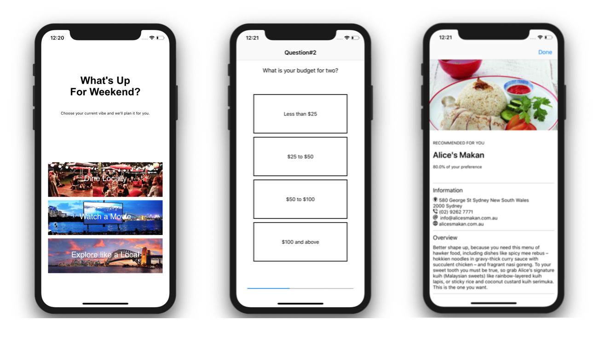

# Recommendator

Recommendator is a simple quiz application that provides recommendations to a user based on their answers to a series of questions.

### Description

Much like a quiz-type application, it collects user's response and gives a suggestion based on the majority of the responses. The app helps the user plans out what type of activity
can be done over the weekend. 

The application's design lets the moderator add multiple questions to precisely recommend what the user really wants.

### Screenshots

### License

Recommendator is available under the MIT License. See [LICENSE](https://github.com/arvnq/Recommendator/blob/master/LICENSE) file for more information.
